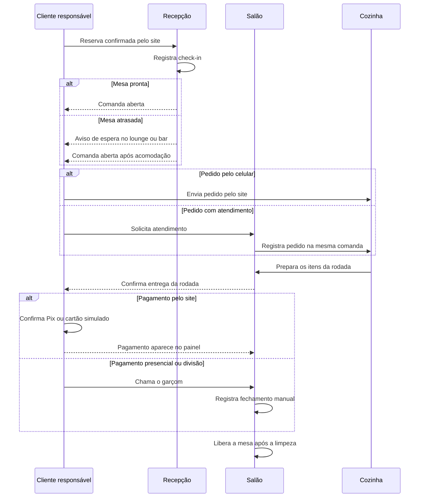

# Jornada do cliente no Santo Garfo

O diagrama mostra como cliente, recepção, salão e cozinha interagem da reserva ao fechamento da conta.

[Voltar ao README](../README.md).

```mermaid
sequenceDiagram
    participant C as Cliente responsável
    participant R as Recepção
    participant S as Salão
    participant K as Cozinha

    C->>R: Reserva confirmada pelo site
    R->>R: Registra check-in
    alt Mesa pronta
        R-->>C: Comanda aberta
    else Mesa atrasada
        R-->>C: Aviso de espera no lounge ou bar
        R-->>C: Comanda aberta após acomodação
    end
    alt Pedido pelo celular
        C->>K: Envia pedido pelo site
    else Pedido com atendimento
        C->>S: Solicita atendimento
        S->>K: Registra pedido na mesma comanda
    end
    K->>S: Prepara os itens da rodada
    S-->>C: Confirma entrega da rodada
    alt Pagamento pelo site
        C->>C: Confirma Pix ou cartão simulado
        C-->>S: Pagamento aparece no painel
    else Pagamento presencial ou divisão
        C->>S: Chama o garçom
        S->>S: Registra fechamento manual
    end
    S->>S: Libera a mesa após a limpeza
```
